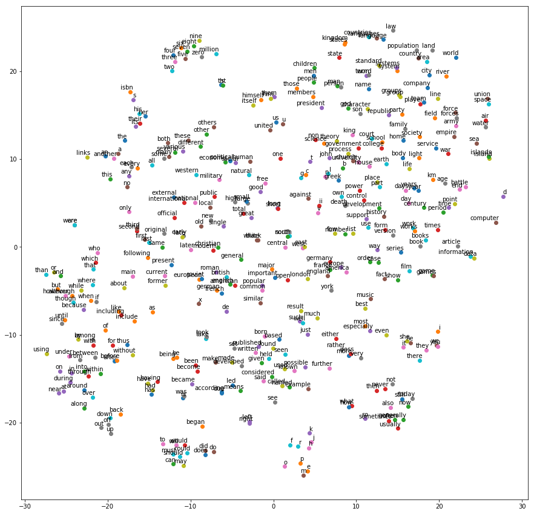

Here are the assignments I have finished for the class:
+ Assignment 1: Preprocess notMNIST data and train a simple logistic regression model on it
+ Assignment 2: Train a fully-connected network using Gradient Descent and Stochastic Gradient Descent
+ Assignment 3: Use regularization techniques to improve a deep learning model
+ Assignment 4: Design and train a Convolutional Neural Network
+ Assignment 5: Train a skip-gram model on Text8 data and visualize the output
+ Assignment 6: Train a Long Short-Term Memory network to predict character sequences

This is an outcome of one of the assignments, a t-SNE projection of word vectors, clustered by similarity.



## Installation and setup

Since the datasets are loaded in memory, 4 GB of RAM are short to run the notebooks, 8 GB will be more comfortable. The instructions are given for Mac OS, but it works on Linux as well.

I recommend to install the Python bundle [Anaconda](https://www.anaconda.com/). All the assignments have been done with Python 2.7, so download the installation script accordingly. You can then install [Jupyter Notebook](http://jupyter.org/) from ``conda``.

The next step is to install TensorFlow. At the time of writing, the latest release is r0.9, after several upgrades during the course. You can refer to the [official documentation](https://www.tensorflow.org/install/#anaconda-installation). Here is the list of commands:

```
$ conda create -n tensorflow python=2.7
$ source activate tensorflow
(tensorflow)$ export TF_BINARY_URL=https://storage.googleapis.com/tensorflow/mac/tensorflow-0.9.0-py2-none-any.whl
(tensorflow)$ pip install --upgrade --ignore-installed $TF_BINARY_URL
```

You can now grab the assignments from here to run my code or the stubs from the [TensorFlow repository](https://github.com/tensorflow/tensorflow/tree/master/tensorflow/examples/udacity). All the other prerequisites (like ``numpy``) have to be installed on the fly.

## Quick start

From the repository root, start the Notebook server with ``jupyter notebook``.

## Credits

+ all the assignments come from [Udacity][udacity-deep-learning] and the [TensorFlow repository][tensorflow-repo]
+ the weird fonts dataset used for this image recognition is the [notMNIST dataset][notmnist] from Yaroslav Bulatov (there are also a download mirrors for the [large][notmnist-large] and [small][notmnist-small] dataset)
+ the final neural network of the assignment #4 is loosely inspired by the notorious LeNet-5, as described in the research paper ["Gradient-Based Learning Applied to Document Recognition"][lenet-5] by Y. LeCun, L. Bottou, Y. Bengio and P. Haffner

[udacity-deep-learning]: https://www.udacity.com/course/deep-learning--ud730
[udacity-nanodegree]: https://www.udacity.com/nanodegree

[jupyter]: http://jupyter.org/
[anaconda]: https://www.continuum.io/
[tensorflow-anaconda-install]: https://www.tensorflow.org/versions/r0.9/get_started/os_setup.html#anaconda-installation
[tensorflow-repo]: https://github.com/tensorflow/tensorflow/tree/master/tensorflow/examples/udacity

[notmnist]: http://yaroslavvb.blogspot.fr/2011/09/notmnist-dataset.html
[notmnist-large]: http://commondatastorage.googleapis.com/books1000/notMNIST_large.tar.gz
[notmnist-small]: http://commondatastorage.googleapis.com/books1000/notMNIST_small.tar.gz
[lenet-5]: http://yann.lecun.com/exdb/publis/pdf/lecun-98.pdf

[tsne-word-vectors]: https://raw.githubusercontent.com/Arn-O/udacity-deep-learning/master/assets/img/word-similarities-tsne.png "t-SNE projection of word vectors clustered by similarities"
